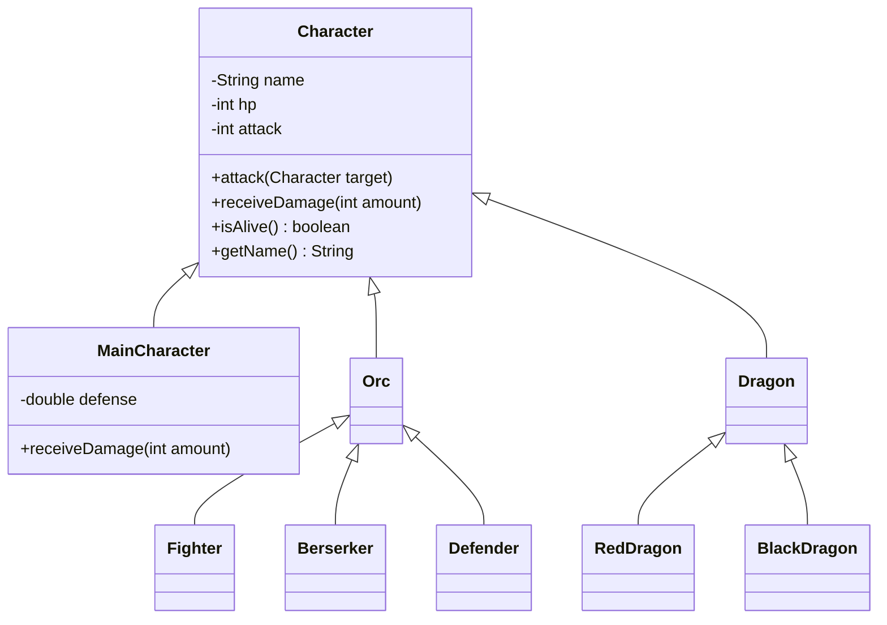

# Arena RPG Specification

A computer roleplaying game where characters fight until one remains. Implement in Java. Follow the `java-clean-code` skill.

## Domain

A character is exactly one of:

- Main character (hero)
- Orc: fighter, berserker, or defender
- Dragon: red or black

Shared data: **name**, **HP**, **attack value**.

Hero only: **defense** (floating-point).

## Combat rules

When A attacks B, B’s HP decreases by a **received damage** derived from A’s attack value.

| Target | Received damage |
| --- | --- |
| Default (fighter orc, and any type without a special rule) | attacker’s attack value |
| Berserker | `2 * attack` |
| Defender | `attack / 2` (integer division; HP and attack are `int`) |
| Black dragon | `attack` if `attack > 20`, otherwise `0` |
| Red dragon | `attack` if `attack > 60`, otherwise `0` |
| Main character | `attack / defense` (floating-point), then truncated toward zero to `int` before subtracting from HP |

Rules do not stack: each concrete type has one receive-damage rule.

**Alive:** a character is alive if and only if `HP >= 0`. `HP == 0` is still alive; dead only when `HP < 0`.

Dead characters do not attack and are not chosen as targets.

## Recommended hierarchy

Packages under `src`:

- `arena` — `Character`, `MainCharacter`, `Main`
- `arena.orc` — `Orc`, `Fighter`, `Berserker`, `Defender`
- `arena.dragon` — `Dragon`, `RedDragon`, `BlackDragon`
- `test` — JUnit tests for the concrete character types

- `Character` is abstract: shared fields, `attack(target)` calls `target.receiveDamage(this.attack)`, default `receiveDamage` subtracts `amount`, `isAlive()` is `hp >= 0`.
- `Orc` and `Dragon` are abstract grouping types (like `Pet` / `WildAnimal` in Zoo).
- Concrete classes override **only** `receiveDamage` when the rule differs (`Berserker`, `Defender`, `RedDragon`, `BlackDragon`, `MainCharacter`). `Fighter` keeps the default.
- Hide fields; no public `hp` bag. No `switch` on type.

## Main program

In `arena.Main`:

1. Instantiate several characters covering every concrete type, with attack values that can both fail and pass dragon thresholds (some `<= 20`, some `21–60`, some `> 60`).
2. Fight until exactly one living character remains:
   - Keep them in a list.
   - While more than one is alive: pick two **different** living characters with `Random.nextInt`, then the attacker `attack`s the defender.
3. Print the winner’s **name** to the console.

If the list starts with one character, print that name. Do not start with an empty list.

## Success criteria

- Every concrete type can be constructed with name, HP, attack (hero also defense).
- Each receive-damage rule matches the table above.
- `isAlive()` matches `HP >= 0`.
- A fight in `main` ends with one printed winner name.
- Code follows the `java-clean-code` skill (especially polymorphism over type switches).

## Out of scope

- GUI, persistence, items, magic, teams, multi-target attacks.
- Required JUnit suite (optional later).
