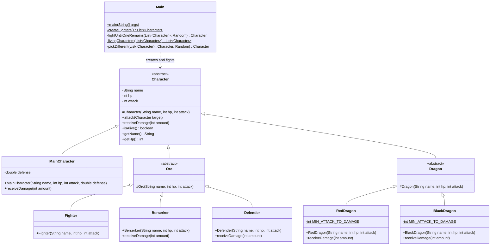

# Arena class diagram

UML class diagram of the arena sources.

Packages:

- `arena` — `Character`, `MainCharacter`, `Main`
- `arena.orc` — `Orc`, `Fighter`, `Berserker`, `Defender`
- `arena.dragon` — `Dragon`, `RedDragon`, `BlackDragon`
- `test` — JUnit tests for the concrete character types

## Legend

- Hollow triangle: inheritance (`extends`)
- Dashed arrow: dependency
- `<<abstract>>`: abstract class
- `$`: static member
- `-` private, `#` protected, `+` public
